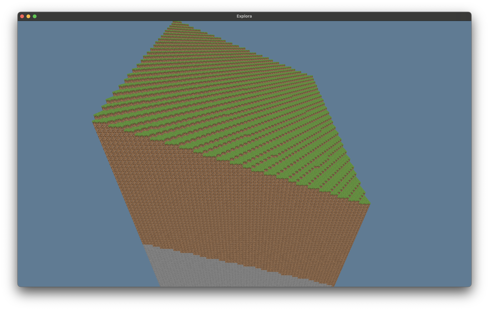

# VoxelExperiment
A basic VoxelEngine written in Rust for learning WGPU.

## Controls

| Key            | Action                |
| -------------- | --------------------- |
| W, A, S, D     | Move around           |
| Space          | Move up               |
| Shift          | Move down             |
| Mouse movement | Look around           |
| Period         | Toggle Cursor         |
| F12            | Toggle Wireframe View |

